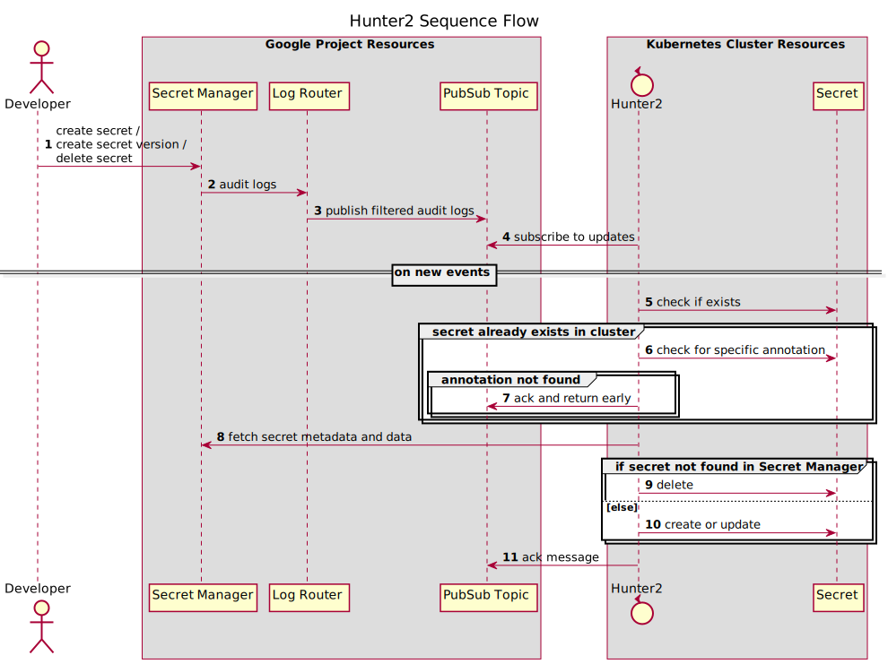

# hunter2

hunter2 is a daemon that performs one-way synchronization of secrets from Google Secret Manager to Kubernetes Secrets.

## Overview



## Prerequisites

### Google Cloud Platform Project

Required APIs/resources and IAM roles/permissions.

#### Secret Manager

hunter2 needs the following roles:

- `roles/secretmanager.secretAccessor` - required for accessing secret data
- `roles/secretmanager.viewer` - required for accessing secret metadata, in our case labels

#### Pub/Sub Topic and Subscription

The Pub/Sub topic is a sink for published audit log events from Secret Manager. 

The Pub/Sub subscription allows hunter2 to react to events in Secret Manager as they are published instead of 
having to continuously perform lookups in Secret Manager for changes.

hunter2 needs the `roles/pubsub.subscriber` role for the subscription.

#### Log Router Sink

Filter audit log events and route them into a sink - in this case a Pub/Sub topic.

The _writer identity_ (service account) for the log router sink should have the `roles/pubsub.publisher` role assigned on the Pub/Sub topic resource.

Filter query:

```
resource.type="audited_resource"
  AND resource.labels.service="secretmanager.googleapis.com"
  AND severity="NOTICE"
  AND resource.labels.method=(
    "google.cloud.secretmanager.v1.SecretManagerService.AddSecretVersion"
    OR "google.cloud.secretmanager.v1.SecretManagerService.DeleteSecret"
  )
```

### Kubernetes Cluster

#### Workload Identity

hunter2 must be set up with a [workload identity](https://cloud.google.com/kubernetes-engine/docs/how-to/workload-identity).

The associated Google Service Account must be set up with the permissions and roles specified earlier.

#### RBAC

```yaml
---
apiVersion: rbac.authorization.k8s.io/v1
kind: ClusterRole
metadata:
  name: hunter2
  namespace: {{ .name }}
rules:
- apiGroups:
  - ""
  resources:
  - secrets
  verbs:
  - create
  - delete
  - get
  - list
  - patch
  - update
  - watch
```

## Development

### Installation

```shell script
make install
```

### Configuration

Set up the required environment variables

```text
HUNTER2_GOOGLE_PROJECT_ID=some-id
HUNTER2_GOOGLE_PUBSUB_SUBSCRIPTION_ID=some-subscription-id
HUNTER2_DEBUG=false
HUNTER2_KUBECONFIG_PATH=$KUBECONFIG
GOOGLE_APPLICATION_CREDENTIALS=/Users/<user>/.config/gcloud/application_default_credentials.json
```

### Run

```shell script
make local
```

## Verifying the hunter2 image and its contents

The image is signed "keylessly" (is that a word?) using [Sigstore cosign](https://github.com/sigstore/cosign).
To verify its authenticity run
```
cosign verify \
--certificate-identity "https://github.com/nais/hunter2/.github/workflows/build_and_push_image.yaml@refs/heads/master" \
--certificate-oidc-issuer "https://token.actions.githubusercontent.com" \
europe-north1-docker.pkg.dev/nais-io/nais/images/hunter2@sha256:<shasum>
```

The images are also attested with SBOMs in the [CycloneDX](https://cyclonedx.org/) format.
You can verify these by running
```
cosign verify-attestation --type cyclonedx  \
--certificate-identity "https://github.com/nais/hunter2/.github/workflows/build_and_push_image.yaml@refs/heads/master" \
--certificate-oidc-issuer "https://token.actions.githubusercontent.com" \
europe-north1-docker.pkg.dev/nais-io/nais/images/hunter2@sha256:<shasum>
```